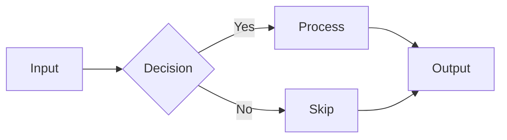
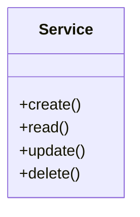
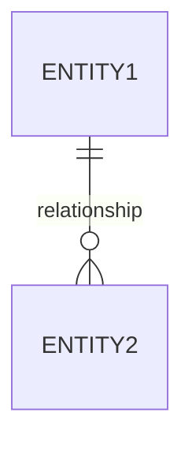

# WIKI.md Template Reference

Complete template for generated documentation. Each section is customizable.

## Required Sections

### 1. Project Overview

```markdown
## Project Overview

### Purpose
Brief description of what the project does.

### Tech Stack

| Category | Technology |
|----------|------------|
| Language | TypeScript |
| Framework | Next.js |
| Database | PostgreSQL |
| ORM | Prisma |

### Key Features
- Feature 1
- Feature 2
- Feature 3
```

### 2. Architecture Overview

```markdown
## Architecture Overview

### High-Level Architecture

\`\`\`mermaid
flowchart TB
    subgraph Frontend
        UI[React Components]
        State[Redux Store]
    end
    
    subgraph Backend
        API[API Routes]
        Auth[Auth Service]
        DB[(Database)]
    end
    
    UI --> State
    State --> API
    API --> Auth
    API --> DB
\`\`\`

### Design Patterns

| Pattern | Usage |
|---------|-------|
| MVC | Separation of UI, logic, data |
| Repository | Data access abstraction |
| Factory | Object creation |
```

### 3. Project Structure

```markdown
## Project Structure

\`\`\`
project/
├── src/
│   ├── components/     # React components
│   ├── pages/          # Next.js pages
│   ├── lib/            # Utility functions
│   ├── hooks/          # Custom React hooks
│   └── types/          # TypeScript types
├── prisma/             # Database schema
├── public/             # Static assets
└── tests/              # Test files
\`\`\`
```

### 4. Core Components

```markdown
## Core Components

### `UserService`

**Purpose:** Handles user CRUD operations and authentication.

**Public API:**

| Method | Parameters | Returns |
|--------|------------|---------|
| `create` | `UserInput` | `User` |
| `findById` | `string` | `User \| null` |
| `update` | `string, UserInput` | `User` |
| `delete` | `string` | `void` |

**Example:**
\`\`\`typescript
const user = await userService.create({
  email: 'test@example.com',
  name: 'Test User'
});
\`\`\`
```

### 5. Data Flow

```markdown
## Data Flow

### Request Lifecycle

\`\`\`mermaid
sequenceDiagram
    participant C as Client
    participant R as Router
    participant M as Middleware
    participant H as Handler
    participant S as Service
    participant D as Database
    
    C->>R: HTTP Request
    R->>M: Auth Check
    M->>H: Route Handler
    H->>S: Business Logic
    S->>D: Query
    D-->>S: Result
    S-->>H: Data
    H-->>C: JSON Response
\`\`\`
```

### 6. Data Model

```markdown
## Data Model

### Entity Relationships

\`\`\`mermaid
erDiagram
    User ||--o{ Post : creates
    User ||--o{ Comment : writes
    Post ||--o{ Comment : has
    Post }|--|| Category : belongs_to
    
    User {
        uuid id PK
        string email UK
        string name
        datetime createdAt
    }
    
    Post {
        uuid id PK
        string title
        text content
        uuid authorId FK
        uuid categoryId FK
    }
\`\`\`
```

### 7. API Reference

```markdown
## API Reference

### Authentication

All endpoints require `Authorization: Bearer <token>` header.

### Endpoints

#### Users

| Method | Endpoint | Description |
|--------|----------|-------------|
| GET | `/api/users` | List all users |
| GET | `/api/users/:id` | Get user by ID |
| POST | `/api/users` | Create user |
| PUT | `/api/users/:id` | Update user |
| DELETE | `/api/users/:id` | Delete user |

**Example Request:**
\`\`\`bash
curl -X GET https://api.example.com/users \
  -H "Authorization: Bearer token123"
\`\`\`

**Example Response:**
\`\`\`json
{
  "data": [
    { "id": "1", "name": "John", "email": "john@example.com" }
  ],
  "meta": { "total": 1, "page": 1 }
}
\`\`\`
```

### 8. Configuration

```markdown
## Configuration

### Environment Variables

| Variable | Required | Default | Description |
|----------|----------|---------|-------------|
| `DATABASE_URL` | Yes | - | PostgreSQL connection string |
| `JWT_SECRET` | Yes | - | Secret for JWT signing |
| `PORT` | No | `3000` | Server port |

### Feature Flags

| Flag | Default | Description |
|------|---------|-------------|
| `ENABLE_CACHE` | `true` | Enable Redis caching |
| `DEBUG_MODE` | `false` | Verbose logging |
```

### 9. Getting Started

```markdown
## Getting Started

### Prerequisites
- Node.js 18+
- PostgreSQL 14+
- pnpm

### Installation

\`\`\`bash
# Clone
git clone https://github.com/org/project
cd project

# Install
pnpm install

# Setup database
pnpm db:push

# Run
pnpm dev
\`\`\`
```

### 10. Development Guide

```markdown
## Development Guide

### Adding a New Feature

1. Create feature branch
2. Add types in `src/types/`
3. Add service in `src/services/`
4. Add route in `src/routes/`
5. Add tests in `tests/`
6. Update this documentation

### Code Style

- Use TypeScript strict mode
- Prefer `const` over `let`
- Use async/await over promises
- Add JSDoc comments for public APIs
```

## Mermaid Diagram Types

### Flowchart (Architecture)


### Sequence (Data Flow)
```mermaid
sequenceDiagram
    Actor->>System: Action
    System->>Database: Query
    Database-->>System: Result
    System-->>Actor: Response
```

### Class (Components)


### ER (Data Model)

